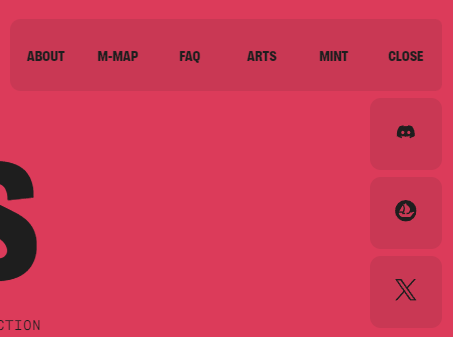

# Ape-NFT

Цей проект є лендінговою сторінкою для продукту Ape NFT, яка має на меті представити його функціональність та привабливий дизайн користувачам.

## Основні технології

- Використовується React або Next.js для розробки фронтенду.

## Основні функціональність та вимоги

### Header:

- Містить логотип і бургер-меню на всіх версіях, з можливістю фіксації мобільного меню та зміни кольору іконок соціальних мереж при прокрутці.
  

### Mobile-menu:

- Має кнопку закриття, навігаційне меню та посилання на соціальні мережі. Пункти меню повинні бути клікабельними, а при кліку мобільне меню має плавно закриватися.
  

### Hero:

- На сторінці є розділ, який плавно прокручується до секції "Mint" при натисканні на відповідний елемент.
  

### About:

- Розділ містить текстовий контент, зображення та банер із можливістю анімації.
  

### MIND Map:

- Використовується CSS Grid для верстки карток, які перетворюються на слайдер на мобільних пристроях.
  

### FAQ:

- Розділ із питаннями та відповідями, де при відкритті пункту змінюється колір запитання та цифри.
  

### Arts:

- Секція із слайдером, що відображається різними кількостями слайдів на різних пристроях.
  

### Контактна форма (MINT):

- Форма з можливістю валідації, відправки та отримання повідомлення про успішну відправку.
  
